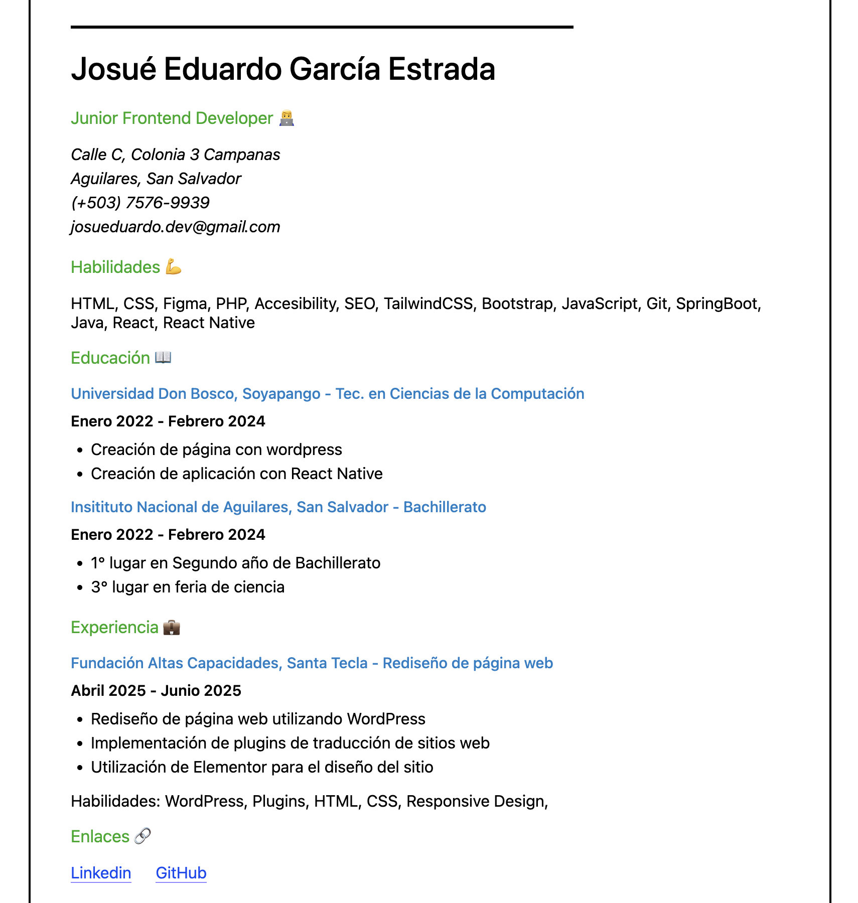

# 🧑‍💻 Proyecto: Single Page CV - HTML

Este es un pequeño ejercicio práctico donde desarrollé un **Currículum Vitae en una sola página (Single Page CV)** utilizando exclusivamente **HTML semántico**, siguiendo las buenas prácticas de accesibilidad, estructura y SEO.

📌 **Recurso base del ejercicio**:  
[https://roadmap.sh/projects/single-page-cv](https://roadmap.sh/projects/single-page-cv)

---

## 📄 Descripción del Proyecto

El objetivo del proyecto fue crear una página web simple pero bien estructurada que funcione como un CV digital. La estructura incluye:

- Un `<header>` con mi nombre y una pequeña introducción.
- Varias secciones con `<section>` y `<article>`:
  - Perfil profesional
  - Habilidades técnicas
  - Educación
  - Experiencia
  - Enlaces de contacto
- Etiquetas meta para SEO y redes sociales (Open Graph)
- Favicon personalizado

---

## 🛠️ Tecnologías usadas

- HTML5
- Metadatos SEO
- Etiquetas Open Graph
- Favicon

> Se utilizó CSS para mejor presentación de la single-page.

---

## 🚀 Cómo verlo en tu navegador

1. Clona el repositorio:
   ```bash
   git clone https://github.com/Josueduardev/frontend-projects-roadmap
   cd frontend-projects-roadmap/01-single-page-CV
   ```

--- 

## 💻 Preview


## 🔗 Enlaces
[https://www.linkedin.com/in/josueduardogarcia/](https://www.linkedin.com/in/josueduardogarcia/)