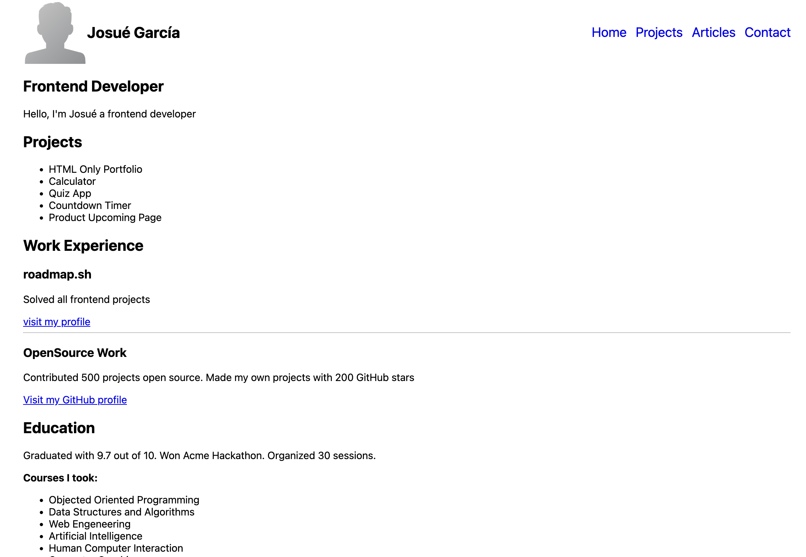

# 👨‍💻 Proyecto: Basic HTML Website - Portfolio Layout Practice

Este es un ejercicio práctico donde desarrollé una **página web estática usando solo HTML y CSS**, simulando un pequeño **portafolio personal** con distintas secciones como presentación, proyectos, experiencia laboral, educación y testimonios.

📌 **Inspiración del proyecto**:  
Diseñar una estructura web desde cero sin frameworks ni librerías externas, aplicando buenas prácticas de maquetación y organización de contenido.

---

## 📄 Descripción del Proyecto

El objetivo de este proyecto fue construir una página de presentación con etiquetas semánticas y una estructura clara y reutilizable. Se incluyen distintas secciones típicas de un portafolio:

- Encabezado con navegación.
- Sección principal con presentación profesional.
- Listado de proyectos desarrollados.
- Experiencia profesional y contribuciones Open Source.
- Educación y cursos destacados.
- Reseñas tipo testimonios.
- Pie de página.

Este proyecto también incluye uso de **metadatos SEO** y etiquetas OG (Open Graph) para simular una web más realista.

---

## 🛠️ Tecnologías usadas

- HTML5
- CSS3 (básico)
- Semántica web
- Flexbox (básico)

---

## 🚀 Cómo verlo en tu navegador

1. Clona el repositorio:
   ```bash
   git clone https://github.com/Josueduardev/frontend-projects-roadmap
   cd frontend-projects-roadmap/02-basic-html-website

--- 

## 💻 Preview


## 🔗 Enlaces
[https://www.linkedin.com/in/josueduardogarcia/](https://www.linkedin.com/in/josueduardogarcia/)