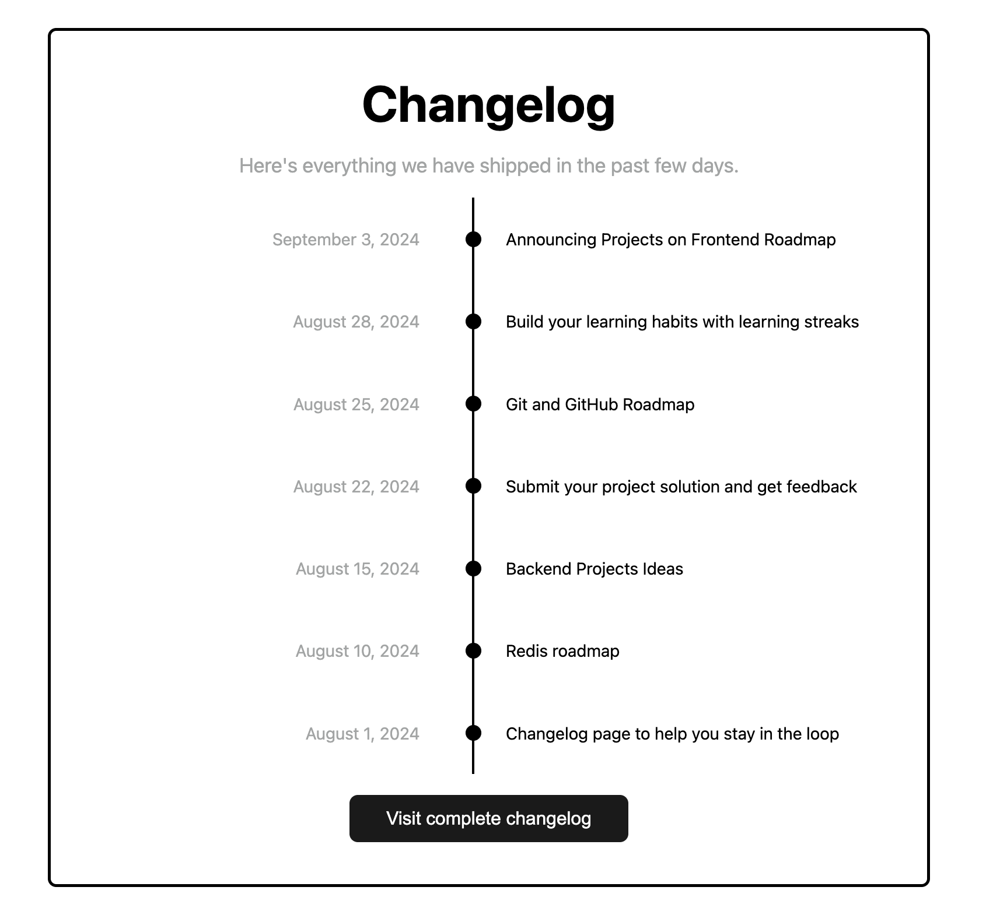

# 👨‍💻 Proyecto: Changelog Component - HTML & CSS

Este es un pequeño ejercicio práctico donde desarrollé una linea de tiempo utilizando HTML y CSS, enfocándome en practicar técnicas de posicionamiento y diseño de layouts, siguiendo buenas prácticas de estructura web.

📌 **Recurso base del ejercicio**:  
[https://roadmap.sh/projects/changelog-component](https://roadmap.sh/projects/changelog-component)

---

## 📄 Descripción del Proyecto

Este proyecto consistió en crear un componente sencillo que muestre los cambios como en una línea de tiempo. El enfoque principal fue practicar el posicionamiento y la distribución de elementos usando CSS.


## 🛠️ Tecnologías usadas

- HTML5
- CSS3
- Grid & Flexbox

---

## 🚀 Cómo verlo en tu navegador

1. Clona el repositorio:
   ```bash
   git clone https://github.com/Josueduardev/frontend-projects-roadmap.git
   cd frontend-projects-roadmap/04-changelog-component
   ```

--- 

## 💻 Preview


## 🔗 Enlaces
[https://www.linkedin.com/in/josueduardogarcia/](https://www.linkedin.com/in/josueduardogarcia/)