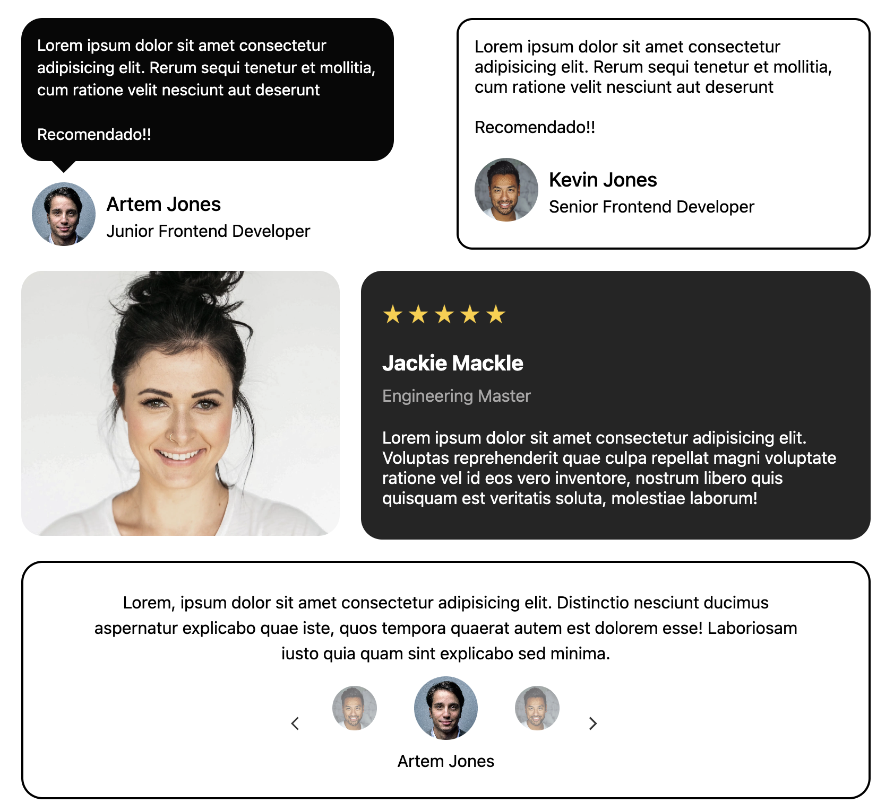

# 👨‍💻 Proyecto: Testimonial Cards - CSS Layout Practice

Este es un pequeño ejercicio práctico donde desarrollé un conjunto de **tarjetas de testimonios utilizando HTML y CSS**, enfocándome en practicar técnicas de posicionamiento y diseño de layouts, siguiendo buenas prácticas de estructura web.

📌 **Recurso base del ejercicio**:  
[https://roadmap.sh/projects/testimonial-cards](https://roadmap.sh/projects/testimonial-cards)

---

## 📄 Descripción del Proyecto

Este proyecto consistió en crear un conjunto de tarjetas de testimonios para una página web. Cada tarjeta muestra la opinión de usuarios o clientes satisfechos, con el objetivo de transmitir confianza y credibilidad.

El enfoque principal fue practicar el posicionamiento y la distribución de elementos usando CSS, organizando las tarjetas de distintas maneras para aprender técnicas de diseño modernas.


## 🛠️ Tecnologías usadas

- HTML5
- CSS3
- Grid & Flexbox

---

## 🚀 Cómo verlo en tu navegador

1. Clona el repositorio:
   ```bash
   git clone https://github.com/Josueduardev/frontend-projects-roadmap
   cd frontend-projects-roadmap/05-testimonial-cards
   ```

--- 

## 💻 Preview


## 🔗 Enlaces
[https://www.linkedin.com/in/josueduardogarcia/](https://www.linkedin.com/in/josueduardogarcia/)