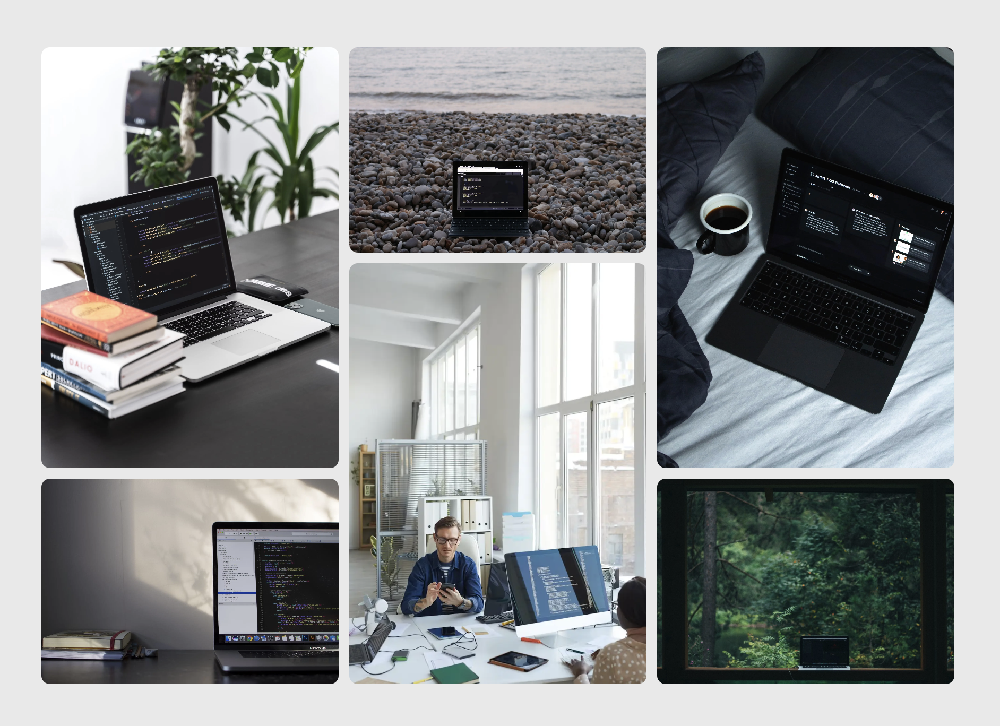

# 👨‍💻 Proyecto: Image Grid Layout

Este es un pequeño ejercicio práctico donde desarrollé una simple galería de imagenes utilizando CSS con layouts como grid y flexbox.

📌 **Recurso base del ejercicio**:  
[https://roadmap.sh/projects/image-grid](https://roadmap.sh/projects/image-grid)

---

## 📄 Descripción del Proyecto

Este proyecto consistió en crear un diseño de cuadrícula con HTML y CSS utilizando seis imágenes, siguiendo un mockup como referencia. 

El objetivo principal fue practicar el uso de CSS Grid para construir layouts modernos, adaptables y visualmente organizados. Se trabajaron conceptos clave como la estructura de la cuadrícula, el diseño responsivo y el manejo del alineamiento y espaciado entre elementos.

## 🛠️ Tecnologías usadas

- HTML5
- CSS3
- Grid & Flexbox

---

## 🚀 Cómo verlo en tu navegador

1. Clona el repositorio:
   ```bash
   git clone https://github.com/Josueduardev/frontend-projects-roadmap
   cd frontend-projects-roadmap/08-image-grid-layout
   ```

--- 

## 💻 Preview


## 🔗 Enlaces
[https://www.linkedin.com/in/josueduardogarcia/](https://www.linkedin.com/in/josueduardogarcia/)%     