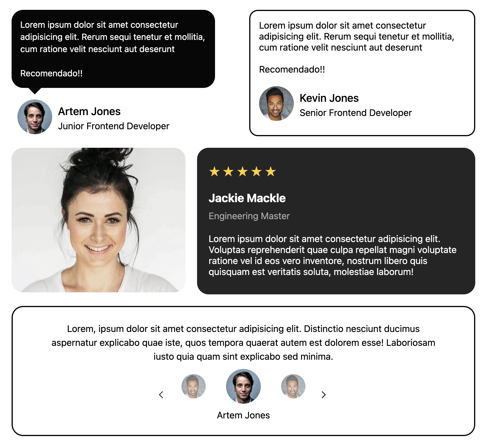

# 🚀 Frontend Projects - HTML + CSS + JavaScript

Este repositorio contiene proyectos prácticos para fortalecer tus habilidades en desarrollo web, basados en los ejercicios propuestos por [roadmap.sh](https://roadmap.sh/frontend).

---

## 📚 Lista de proyectos

- [01 - Single Page CV](https://roadmap.sh/projects/single-page-cv)
- [05 - Testimonial Cards](https://roadmap.sh/projects/testimonial-cards)
- [08 - Image Grid Layout](https://roadmap.sh/projects/image-grid-layout)

---

## 🖼️ Vista de proyectos

<p align="left">
  <a href='./01-single-page-CV/'>
    
  </a>
  <a href='./05-testimonial-cards/'>
    
  </a>
</p>
<p align="left">
  <a href='./08-image-grid-layout/'>
    
  </a>
</p>

---

## 🛠️ ¿Qué se practicó?

- HTML semántico
- Flexbox y CSS Grid
- Responsive Design
- Buenas prácticas visuales
- Componentes reutilizables y layouts

---

## ▶️ Cómo usar

1. Clona este repositorio
2. Abre los archivos `.html` con tu navegador o usa Live Server (VS Code)
3. Explora, modifica y aprende

```bash
git clone https://github.com/tu-usuario/tu-repo.git
cd nombre-del-repo
